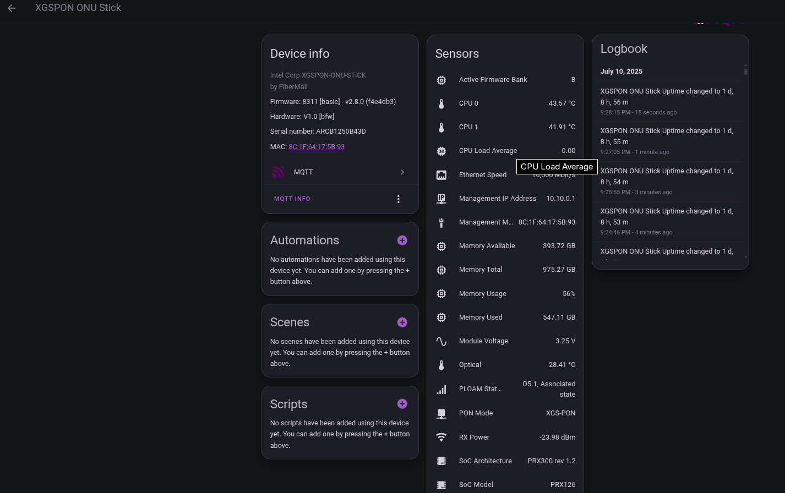

# 8311 ONU Exporter for Home Assistant (Python)
This is a Python script that will:
- Query an API endpoint on the ONU device for temps and other data
- SSH into the ONU stick to grab the ONU host IP MAC
- Publish HASS MQTT device config and entity state data to create a device with entities that can be used in Home Assistant

# Pre-requisites
- SSH password-less login to the ONU from the script host (copy script host SSH key over to the ONU)
- Home Assistant (HASS) installed and running
- MQTT broker (EMQX, Mosquitto, etc.)
- [MQTT integration](https://www.home-assistant.io/integrations/mqtt/) configured in HASS and [MQTT auto-discovery](https://www.home-assistant.io/integrations/mqtt/#mqtt-discovery) enabled
- _Optional, but recommended:_ `python-venv` to create a virtual environment for Python to avoid conflicts with other Python packages

# Installation
- Clone this repository and `cd` into it
- Copy the `example.env` file and rename it to `.env`
- Edit the newly created `.env` to match your MQTT broker settings and edit the ONU device characteristics if it is different from the example.
- _Optional:_ Set up a virtual environment for Python: `python3 -m venv venv`
- Install required packages (see [`requirements.txt`](./requirements.txt)): `pip install -r requirements.txt`
- Set up systemd service and timer or a cron job to run the script periodically (See the [SystemD](#systemd) and [Cron](#cron) sections below)

# Usage
To test the script, run it manually:

```bash
# no virtual environment:
python3 onu_exporter.py

# with virtual environment:
./venv/bin/python3 onu_exporter.py
```

## SystemD
See the example systemd service and timer files in the [`systemd`](./systemd) directory. 
Edit the service file and change `WorkingDirectory` to point to the repo directory (where the script and .env file are). 
You can copy them to `/etc/systemd/system/` and enable them with:

```bash
sudo systemctl daemon-reload && sudo systemctl daemon-reexec
sudo systemctl enable --now onu_exporter.timer
```

## Cron
>[!NOTE]
> I haven't tested cron jobs, but they should work.

Example cron job:

### Without virtual environment
```
* * * * * python3 /path/to/onu_exporter.py >> /var/log/onu_exporter.log 2>&1
```

### With virtual environment
```
* * * * * /path/to/venv/bin/python3 /path/to/onu_exporter.py >> /var/log/onu_exporter.log 2>&1
```

# MQTT Device Example

This script will create a MQTT device that looks something similar to this in Home Assistant:



You can change the device name, model, and other characteristics in the [`.env`](./example.env) file to match your ONU device:

```dotenv
#-- These can be anything you want, see the screenshot above to see where the data will be displayed in Home Assistant --
DEVICE_MANUFACTURER="FiberMall"
DEVICE_NAME="XGSPON ONU Stick"
#-- DEVICE_MODEL will default to the `module_info` value from the 8311 web GUI status page if not set here --
#DEVICE_MODEL="XGSPON-ONU-STICK"
#-- For now, these must be set manually --
DEVICE_SW_VERSION="8311 [basic] - v2.8.0 (f4e4db3)"
DEVICE_HW_VERSION="1.0 [bfw]"
```

# API Data Output Example
Here is an example of the data returned by the API for the Intel Fibermall XGSPON ONU:

```
{
'active_bank': 'B', 
'temperature': '43.16 °C (109.7 °F) / 41.50 °C (106.7 °F) / 28.00 °C (82.4 °F)', 
'eth_speed': '10000 Mbps', 
'power': '-24.09 dBm / 6.22 dBm / 33.24 mA', 
'status': 'O5.1, Associated state', 
'pon_mode': 'XGS-PON', 
'module_info': 'Intel Corp XGSPON-ONU-STICK V1.0 (bfw)', 
'voltage': '3.26 V'
}
```