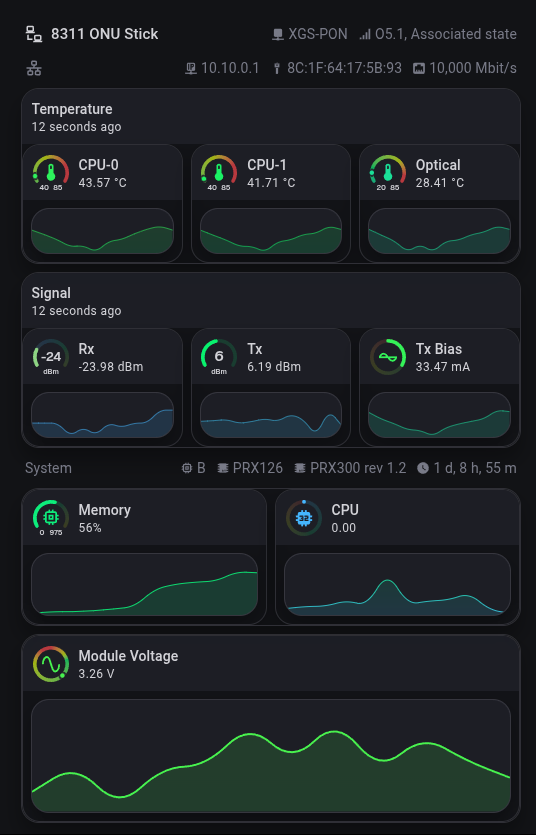

# 8311 ONU Exporter for Home Assistant (Python)
This is a Python script that will:
- SSH into the ONU stick to grab related information
- Publish HASS MQTT device config and entity state data to create a device with entities that can be used in Home Assistant

# Pre-requisites
- 8311 ONU device, configured and working
- ONU device IP is reachable (see [the pon.wiki network setup docs](https://pon.wiki/guides/install-the-8311-community-firmware-on-the-was-110/#network-setup)) 
- SSH password-less login to the ONU from the script host (copy script host SSH key over to the ONU)
- Home Assistant (HASS) installed and running
- MQTT broker (EMQX, Mosquitto, etc.)
- [MQTT integration](https://www.home-assistant.io/integrations/mqtt/) configured in HASS and [MQTT auto-discovery](https://www.home-assistant.io/integrations/mqtt/#mqtt-discovery) enabled
- _Optional, but recommended:_ `python-venv` to create a virtual environment for Python to avoid conflicts with other Python packages

# Installation
- Clone this repository and `cd` into it
- Copy the `example.env` file and rename it to `.env`
- Edit the newly created `.env` to match your MQTT broker settings and edit the ONU device characteristics if it is different from the example.
- _Optional:_ Set up a virtual environment for Python: `python3 -m venv venv`
- Install required packages (see [`requirements.txt`](./requirements.txt)): `pip install -r requirements.txt`
- Set up systemd service and timer or a cron job to run the script periodically (See the [SystemD](#systemd) and [Cron](#cron) sections below)

# Usage
>[!NOTE]
> You can change the temperature scale between Celsius and Fahrenheit by setting the `ONU_TEMP_SCALE` variable in the `.env` file to either `C` or `F`. The default is `C`.

To test the script, run it manually:

```bash
# no virtual environment:
python3 onu_exporter.py

# with virtual environment:
./venv/bin/python3 onu_exporter.py
```

## SystemD
See the example systemd service and timer files in the [`systemd`](./systemd) directory. 
Edit the service file and change `WorkingDirectory` to point to the repo directory (where the script and .env file are). 
You can copy them to `/etc/systemd/system/` and enable them with:

```bash
sudo systemctl daemon-reload && sudo systemctl daemon-reexec
sudo systemctl enable --now onu_exporter.timer
```

## Cron
>[!NOTE]
> I haven't tested cron jobs, but they should work.

Example cron job:

### Without virtual environment
```
* * * * * python3 /path/to/onu_exporter.py >> /var/log/onu_exporter.log 2>&1
```

### With virtual environment
```
* * * * * /path/to/venv/bin/python3 /path/to/onu_exporter.py >> /var/log/onu_exporter.log 2>&1
```

# MQTT Device Example

This script will create a MQTT device that looks something similar to this in Home Assistant:


## Setting manufacturer and device name
Most data is pulled from the stick via SSH. You'll need to set the manufacturer (Fibermall, ECNI, etc.) and the 
name of the device to whatever you like in the [`.env`](./example.env) file:

```dotenv
#-- These can be anything you want, see the screenshot above to see where the data will be displayed in Home Assistant --
DEVICE_MANUFACTURER="FiberMall"
DEVICE_NAME="XGSPON ONU Stick"
```

## Why so many sensors?
The script creates a lot of sensors to provide detailed information about the ONU device which can then be used in a [lovelace card](#example-lovelace-card)

# Example lovelace card
[There is a card example](./examples/ring-tile.yaml) that uses a sections view with custom cards:
- card-mod
- layout-card
- [ring-tile](https://github.com/neponn/ring-tile-card)
- vertical-stack-in-card
- mushroom-template-card
- mini-graph-card



You may need to change sensor entity_ids in the card to match your MQTT device entity IDs and the color gradients arent dialed in yet, so you may need to adjust the colors to your liking.

I am adding sensors that will represent min/max values for the temperature, signal, and voltage sensors, so you can use (and configure via .env) those instead of hardcoding.